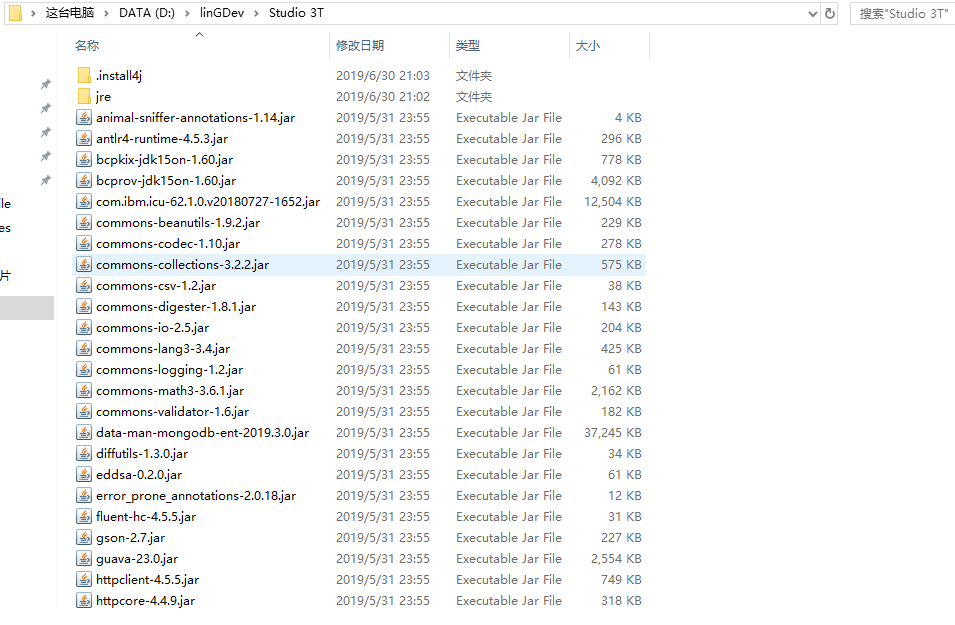
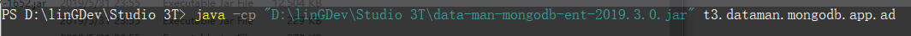
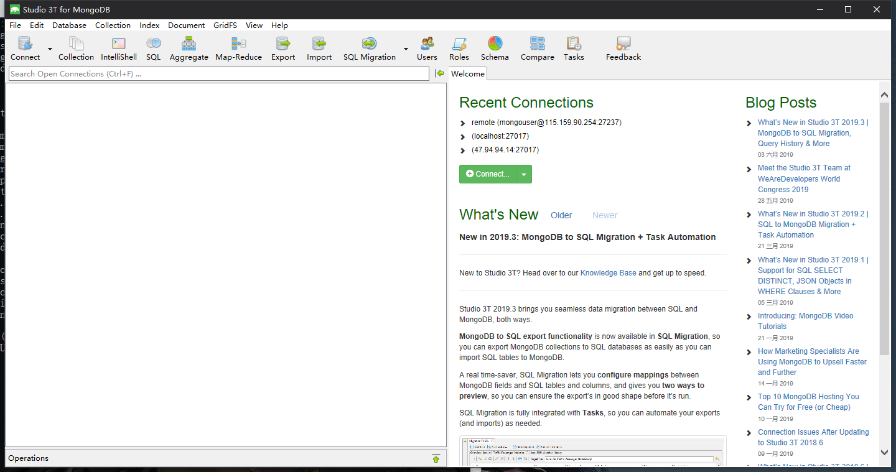
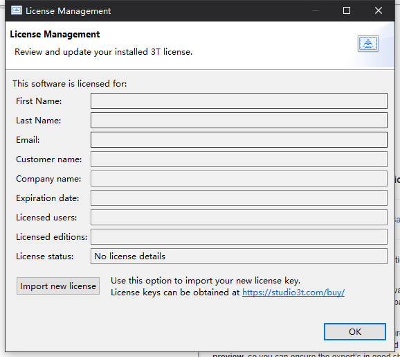

## Studio3TCrack

[English](https://github.com/linG5821/Studio3TCrack/blob/master/README.md) | 中文

#### Studio 3T

  Studio 3T是一个功能强大的MongoDB数据库管理工具，它提供GUI可视化操作。它可以完全让您告别命令行。软件提供30天的适用版本!

#### Studio3TCrack介绍

  首先，我想表达我的歉意。这个项目绕过了许可证测试，这意味着Studio 3T可以无限期地使用。但是**Pro** 和**Enterprise** 企业功能没有被修改,这个程序仅供学习和交流,如果有需要,请购买正版Studio 3T](https://studio3t.com)


#### 怎么使用

##### Package replace:
  1. 备份data-man-mongodb-ent-2019.3.0.jar包

  2. 拷贝项目中data-man-mongodb-ent-2019.3.0.jar包到安装目录替换原有的包

  3. 运行官方的二进制可执行文件

##### command mode:
  1. 注意！注意！现在无需使用任何jar包只需要运行命令即可轻松跳过验证。

  2. 拷贝Studio3T安装目录下一个名为data-man-mongodb-xxxxx.jar的文件路径。

  3. 在任意目录下执行java -cp path(上面复制的路径,必须为绝对路径) t3.dataman.mongodb.app.ad

  4. Mac
    java -XstartOnFirstThread -cp path(上面复制的路径,必须为绝对路径) t3.dataman.mongodb.app.ad

   ```bash
   # ! /bin/bash
   nohup java -cp path(上面复制的路径,必须为绝对路径) t3.dataman.mongodb.app.ad >/dev/null 2>&1 &
   ```
#### 版本更新:
    2019.7.26: 1.提供可以直接替换的data-man-mongodb包可以直接拷贝至安装目录进行替换，然后直接官方自带的二进制可执行文件即可，本次包版本2019.3.0
               2.问题:不能够保存自定义设置，但是连接信息可以保存 
               3.可以使用企业版功能 使用方式:点击 help->license manager 随便输入一些东西 提示错误后 点击ok 即可使用企业版功能
    2019.6.27: 更新启动方式为脚本命令的方式，移除代码级别的控制
    studio-3t-start-2019.2.1:更新了代码实现，使用了新的思路，适应Studio3T新版本2019.2.1版本
    使用方式：与以往相同,路径中不要出现空格，中文，特殊字符
    构建：本次直接打包了可执行的jar文件包含全部依赖包，可以直接使用，请查看release

#### 图片指引







